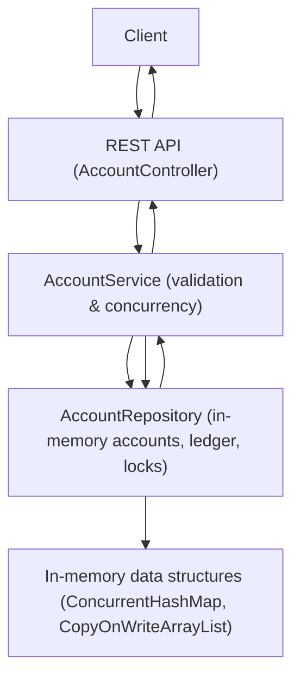

# banking-transaction-processor

A Java service for processing banking transactions. Supports account management with unique account IDs, thread-safe deposits, withdrawals, transfers, validation against overdrafts and invalid amounts, and an in-memory per-account transaction ledger.

## Project Overview

- Language: Java 21
- Framework: Spring Boot
- Build: Maven

The service exposes HTTP endpoints to create accounts, deposit, withdraw, transfer funds, and query balances and transaction histories. All account operations are thread-safe and use per-account locks and atomic operations to prevent race conditions.

## Architecture

- Model/Domain: `com.bank.model` (Account, TransactionRecord, TransactionType)
- Repository: `com.bank.repository` (in-memory store, per-account ledger, locks)
- Service: `com.bank.service` (business logic, validation, thread-safety)
- Controller/API: `com.bank.controller` (REST endpoints)
- DTOs: `com.bank.dto` (request/response shapes)

Mermaid flowchart (end-to-end flow):



## End-to-end Flow

1. Client calls API.
2. Controller validates request and forwards to `AccountService`.
3. `AccountService` acquires per-account locks (or ordered locks for transfers), performs atomic balance updates, creates `TransactionRecord` entries, and stores them in the repository ledger.
4. Controller returns the transaction record or result to the client.

## Build, Test, and Run (local)

Prerequisites: Java 21, Maven 3.8+

Build:

```bash
mvn -v
mvn clean package -DskipTests=false
```

Run:

```bash
mvn spring-boot:run
# or run the generated jar
# java -jar target/banking-service-1.0.0.jar
```

Service will start on `http://localhost:8080` by default.

Run tests:

```bash
mvn test
```

Notes about Java 21 features used

- This project is configured to compile with Java 21. The test suite includes an example of using Java 21 virtual threads (Loom) to run many concurrent account operations to validate thread-safety.

## API Endpoints

Base URL: `http://localhost:8080/api`

1. Create account

POST `/api/accounts`

Request body (optional):

```json
{ "initialBalance": 100.00 }
```

Response:

```json
{ "accountId": "<uuid>" }
```

2. Get balance

GET `/api/accounts/{accountId}/balance`

Response:

```json
{ "balance": 100.00 }
```

3. Get transactions

GET `/api/accounts/{accountId}/transactions`

Response: list of transaction records

4. Deposit

POST `/api/accounts/{accountId}/deposit`

Request body:

```json
{ "amount": 25.50, "description": "paycheck" }
```

5. Withdraw

POST `/api/accounts/{accountId}/withdraw`

Request body:

```json
{ "amount": 10.00, "description": "atm" }
```

6. Transfer

POST `/api/accounts/transfer`

Request body:

```json
{ "from": "<uuid-from>", "to": "<uuid-to>", "amount": 5.00, "description": "rent" }
```

Example cURL commands

Create account (with initial balance):

```bash
curl -X POST http://localhost:8080/api/accounts -H "Content-Type: application/json" -d '{"initialBalance":100.00}'
```

Deposit:

```bash
curl -X POST http://localhost:8080/api/accounts/<accountId>/deposit -H "Content-Type: application/json" -d '{"amount":25.50, "description":"paycheck"}'
```

Withdraw:

```bash
curl -X POST http://localhost:8080/api/accounts/<accountId>/withdraw -H "Content-Type: application/json" -d '{"amount":10.00, "description":"atm"}'
```

Transfer:

```bash
curl -X POST http://localhost:8080/api/accounts/transfer -H "Content-Type: application/json" -d '{"from":"<uuid-from>", "to":"<uuid-to>", "amount":5.00, "description":"rent"}'
```

Query balance:

```bash
curl http://localhost:8080/api/accounts/<accountId>/balance
```

Query transactions:

```bash
curl http://localhost:8080/api/accounts/<accountId>/transactions
```

## Notes

- The implementation uses in-memory storage; for production, replace the repository with a persistent backing store.
Concurrency handled with per-account locks and atomic updates to prevent race conditions and overdrafts.

## Docker (run without Java/Maven)

Files added: `Dockerfile`, `docker-compose.yml`, `.dockerignore`.

Build and run with Docker Compose:

```bash
docker compose up --build
```

Or build and run manually:

```bash
docker build -t banking-service .
docker run -p 8080:8080 banking-service
```

Service will be available at `http://localhost:8080/api`.

Notes:
- Docker uses a multi-stage build: Maven build image then a JRE runtime image.
- Ensure Docker Engine is installed and running on your machine.
=======
# banking-transaction-processor
