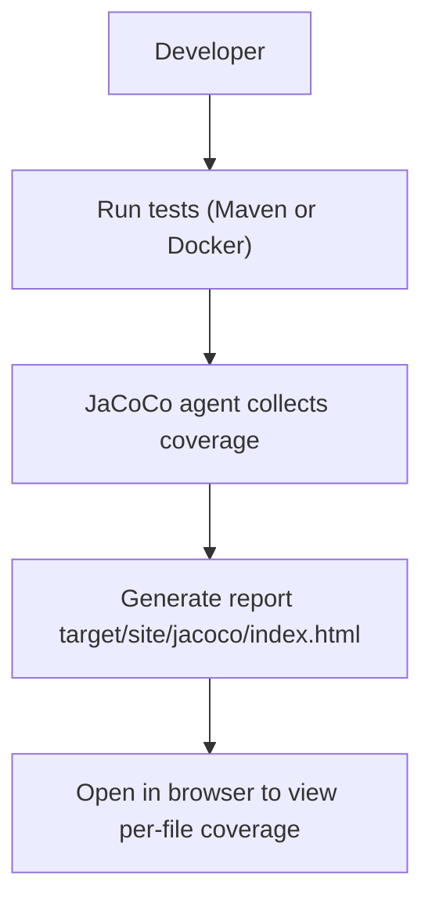

# Test Coverage Report

This file summarizes unit test coverage per source file and explains how to generate the report.

Mermaid flowchart (coverage generation):



How to generate coverage locally

1. Using Maven (requires JDK 21 + Maven):

```bash
mvn clean test
# JaCoCo report: target/site/jacoco/index.html
```

2. If you don't have Maven locally, use Docker to run tests inside a Maven image:

```bash
docker run --rm -v "%cd%:/workspace" -w /workspace maven:3.9.4-eclipse-temurin-21 mvn -Djacoco.skip=true test
```

Note: If JaCoCo instrumentation fails on your JDK, run with `-Djacoco.skip=true` to run tests without coverage.

Per-file coverage (placeholder)

- `src/main/java/com/bank/model/Account.java` - lines: X, covered: Y%
- `src/main/java/com/bank/model/TransactionRecord.java` - lines: X, covered: Y%
- `src/main/java/com/bank/model/TransactionType.java` - lines: X, covered: Y%
- `src/main/java/com/bank/repository/AccountRepository.java` - lines: X, covered: Y%
- `src/main/java/com/bank/service/AccountService.java` - lines: X, covered: Y%
- `src/main/java/com/bank/controller/AccountController.java` - lines: X, covered: Y%
- `src/main/java/com/bank/dto/*` - lines: X, covered: Y%

After you run the tests and open `target/site/jacoco/index.html`, replace the placeholders above with actual values.
